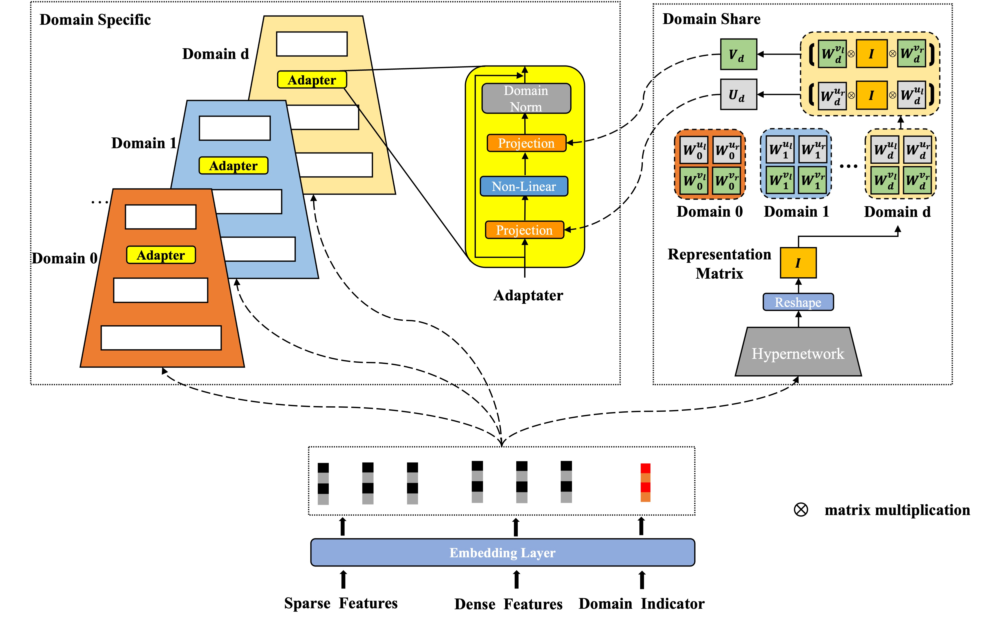
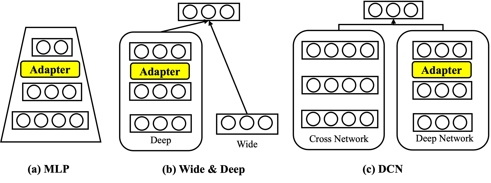

# HAMUR

Official implementation of our paper [HAMUR: Hyper Adapter for Multi-Domain Recommendation](https://arxiv.org/pdf/2309.06217.pdf) in CIKM 2023.

You could cite our paper if you find this repository interesting or helpful:
```
@inproceedings{li2023hamur,
  title={HAMUR: Hyper Adapter for Multi-Domain Recommendation},
  author={Li, Xiaopeng and Yan, Fan and Zhao, Xiangyu and Wang, Yichao and Chen, Bo and Guo, Huifeng and Tang, Ruiming},
  booktitle={Proceedings of the 32nd ACM International Conference on Information and Knowledge Management},
  pages={1268--1277},
  year={2023}
}
```

## Introduction
Source code of HAMUR: Hyper Adapter for Multi-Domain Recommendation, in Proceedings of the 32nd ACM International Conference on Information and Knowledge Management(CIKM 23').


## Environment Setting
* torch >=1.7.0
* numpy >=1.23.5
* pandas >=1.5.3
* scikit-learn >=0.23.2

## Dataset Download
In this paper, we use two datasets, **Aliccp** and **movieLens**. Dataset samples are shown in example/ranking/data.

Real Dataset download methods:
* Aliccp: Download address https://tianchi.aliyun.com/dataset/408.
* Movielens: The raw data process file can be found in [Torch-Rechub-ml-1m](https://github.com/morningsky/Torch-RecHub/tree/main/examples/matching/data/ml-1m). You could directly download the processed file from https://cowtransfer.com/s/5a3ab69ebd314e.

## Models
In this repo, we offer the following models list as follows. And their structures are shown in the picture.

* Pure MLP as Multi-domain Backbone models.
* MLP + HAMUR
* Pure Wide & Deep as Multi-domain Backbone models.
* Wide & Deep + HAMUR
* Pure DCN as Multi-domain Backbone models. 
* DCN + HAMUR

## Usage

### Step 1: Clone the repository
```Shell
git clone https://github.com/Applied-Machine-Learning-Lab/HAMUR.git
```

### Step 2: Run the model
```Shell
cd examples
# For Aliccp
python run_ali_ccp_ctr_ranking_multi_domain.py --model_name mlp_adp --epoch 200 --device cpu --seed 2022 
# For MovieLens
python run_movielens_rank_multi_domain.py --model_name mlp_adp --epoch 200 --device cpu --seed 2022 

```

## Credits
Our code is developed based on [Torch-RecHub](https://github.com/datawhalechina/torch-rechub). Thanks to their contribution.


